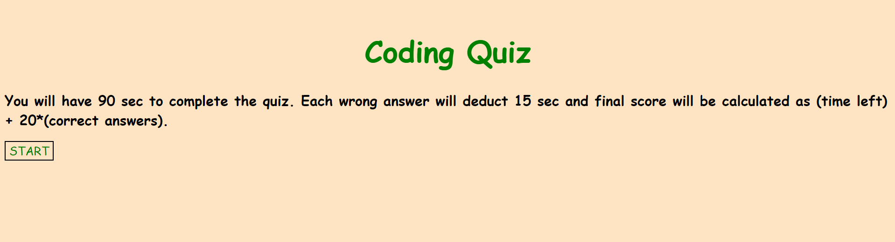
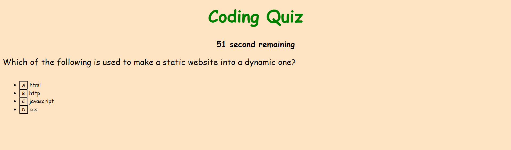
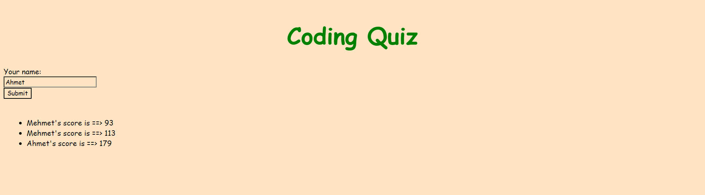

# Coding Quiz Game

## Summary
A quiz application with questions gauging the user's Javascript knowledge. When the user clicks the start button quiz begins. It gives the user 150 seconds to complete all the questions. Every wrong answer deducts 15 seconds from the timer and every correct answer adds 20 points to the user's score. After finishing the quiz, the user can submit their score along with their username, which are then stored in the webpage's local storage. Upon submitting their own score, the user can see the scoreboard with score submissions from all the previous users who took the quiz. 

## Technologies Used
<ul>
  <li><b>HTML</b></li>
  <li><b>CSS</b></li>
  <li><b>JavaScript<b></li>
  <li><b>Git</b></li>
  <li><b>GitHub</b></li>
  <li><b>Google Chrome</b></li>
 </ul>
 
 ## Deployed Link
[ Coding Quiz](https://mehmetmusabeyoglu.github.io/Coding-Quiz-Game/)
 
 ## Credits
 N/A
 
 ## Author Links
 [LinkedIn](https://www.linkedin.com/in/mehmet-musabeyo%C4%9Flu-788758a8/)
  
 [GitHub](https://github.com/MehmetMusabeyoglu) 
 
 ## License 
 This project is licensed under the MIT License 
  
 
